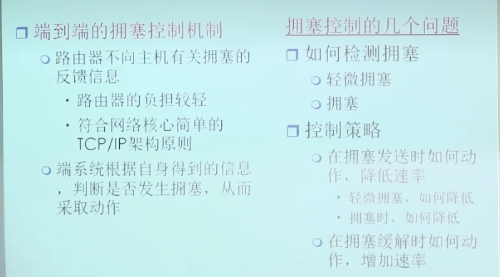
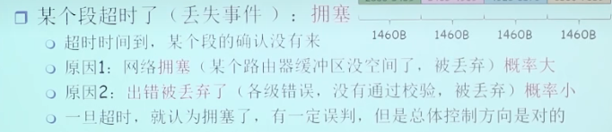
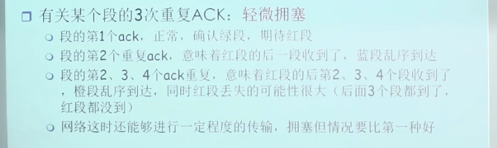
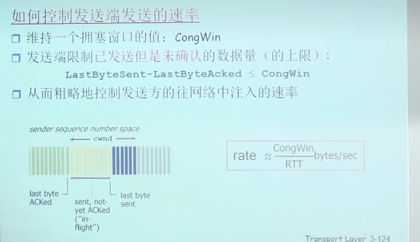
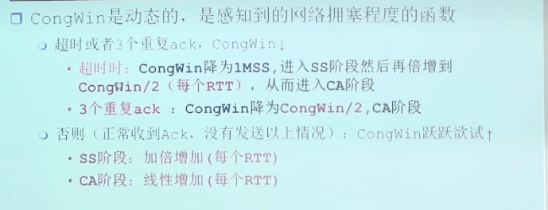
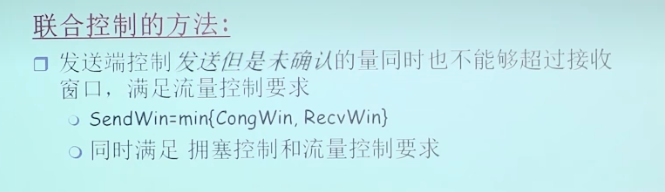
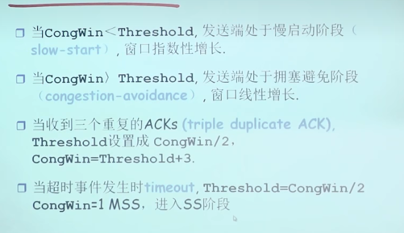

* 采用辅助信息控制的方式，会造成网络负担较重的情况，所以TCP协议采取的是端到端的拥塞控制
* TCP/IP网络架构把复杂性放在边缘，减小网络的负担
* 拥塞控制机制和拥塞需要解决的问题
  * 
* 对于检测出错的情况不应该当作拥塞来处理，否则是误操作，但是出错的概率一般比较小
* 发送端检测到拥塞
  * 超时的情况(丢失事件)：拥塞

    * 
  * 检测到3个冗余ACK

    * 
* 控制发送方的发送速率
  * CongWin是在未得到对方确认的情况下，向网络当中注入字节的数量
  * 
* 联合拥塞控制
  * 
* TCP拥塞控制策略概述、
  * 慢启动：每个RTT 都 double CongWin的值
  * AIMD
  * 超时事件后的保守策略
* 当一开始指数型增加之后发生拥塞时，需要记住警戒值，然后再一次回到一个MSS，进入慢启动阶段，当到达警戒值的时候，再转为线性增加；期间如果遇到三个冗余ACK，则窗口值缩小一半，再加上3，转入CA，线性增加
* TCP拥塞控制
  * 
* 拥塞控制机制保证了公平性
