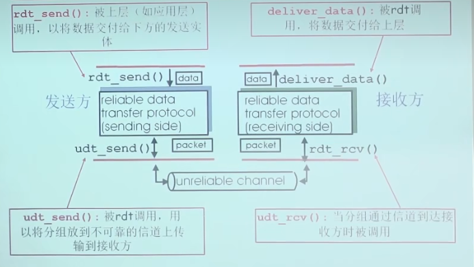
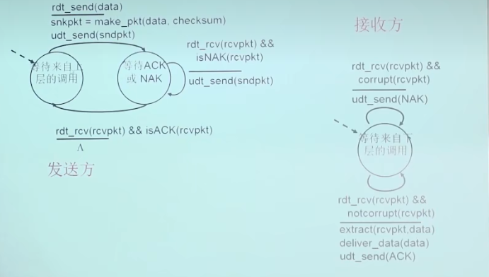
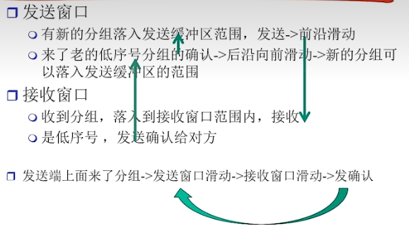
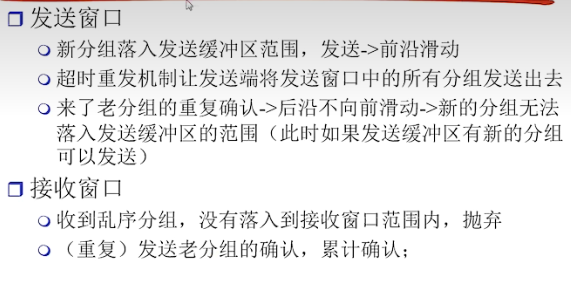
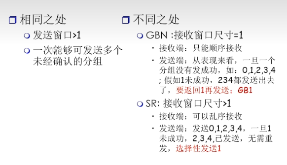
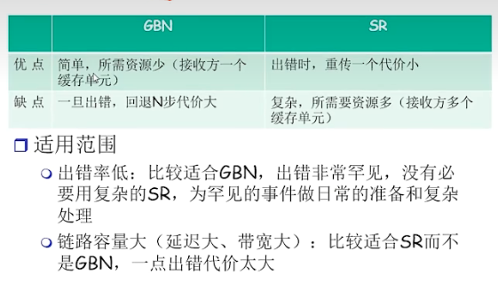

### 可靠数据传输

* 可靠数据传输应该实现的特性：

  * 不出错
  * 不失序
  * 不重复
  * 不丢失
* 问题描述

  * 
  * 其中rdt_send()和deliver_data()都是层间接口；udt_send()和rdt_rcv()是本层和下层的原语，即能够提供给下层的服务
  * 有限状态机：状态——在该状态的时候，下一个状态只能由下一个事件唯一确定
  * 有限状态机之间的边——分子代表引发状态变迁的事件，分母代表状态变迁时采取的动作(协议采取的动作)
  * 有限状态机只描述数据的单向传输，但是控制信息是双向流动的
* RDT1.0：在可靠信道上的可靠数据传输

  * 对于本层而言，一定有来自上层原语的调用(本层服务被调用)和对于下层服务的调用(本层主动调用下层服务)
* RDT2.0：具有比特差错的信道

  * 下层信道可能会出错，使用校验和来检验比特差错
  * 从差错中恢复：
    * ACK确认，接收方显式地告诉发送方分组已经正确接收
    * NAK：显示告诉发送方分组出现了差错
      * 当发送方接收到了NAK之后，会进行重传
  * 新机制：采用差错控制编码进行差错检测
    * 发送方差错控制编码、缓存(缓存是为了重传)
    * 接收方使用编码检错
    * 接收方的反馈
    * 发送方根据反馈进行动作
  * 
* RDT2.1(停等协议)：

  * 解决ACK和NAK有可能出错的情况的机制
  * 给每个分组编一个序号，当发送方接收到的确认分组既不是ACK也不是NAK，就重传一遍刚刚发送的分组；如果原来接收方收到的是正确的但是ACK出错了，那么接收方会接收到同样的分组，发现序号重复，此时会将重复的分组丢弃然后再发一次ACK
  * 接收方可能出现的情况
    * 收到正确的当前等待的序号的分组——发ACK
    * 收到重复的分组——发ACK
    * 收到错误的分组——发NAK
  * 在这个协议中，分组序号只有0和1
  * 本协议中状态数变成了两倍，因为必须记住当前的分组序号是0还是1
  * 这个协议的不足在于接收方不知道发送方是否正确收到了ACK/NAK
* rdt2.2：NAK Free；解放NAK

  * 对ACK进行编号，ACKn-1 == NAK n，这样对于需要发NAK的场景，只需要发一次上一个分组的ACK，即可说明上一个分组收到了而当前这个分组出错了，没有接收下来
* rdt3.1：使用超时重传解决分组丢失的问题

  * 发送方发送的分组丢失，那么接收方会一直等待分组，发送方一直等待ACK，造成死锁
  * 超时的时间比一个RTT要稍长一些，不然会造成不必要的重传
  * 超时重传可能造成重复，但是重复已经解决了
  * 超时重传的时间设置：可以根据上一个报文段的传输时间来计算
  * 过早的超时会造成大量的重复
* 从rdt2.1开始都是停等协议，停等就是等分组到了才发下一个，所以在信道容量比较大的时候，效率很低，解决方法是一次发送多个分组，即流水线协议
* 流水线协议

  * 发送方和接收方都需要设置缓冲区
  * 一般性协议——滑动窗口协议
    * 针对缓冲区的大小分为三种协议
      * SW = 1 AND RW = 1 ->停等协议
      * SW > 1 AND RW = 1 -> GBN
      * SW > 1 AND RW > 1 -> SR选择重传协议
    * 发送缓冲区的作用：将发送出去的分组进行缓存，以便于检错重发和超时重发
    * 发送窗口指的是发送缓冲区的一个范围，一个子集，表示已经发送但是没有经过确认的分组
    * 收到滑动窗口以外的分组则直接抛弃
  * GBN协议
    * 接收方发送分组根据顺序到来的最高分组发送确认
    * 接收窗口的大小等于1
  * SR协议
    * 收到哪个分组就发送哪个分组的确认，但是只有最高分组的确认也发送了，窗口才能向前移动
    * 接收窗口大小 > 1
  * SR和GBN的区别在于接收方窗口大小不一，相同点是发送方可以发送很多个分组
  * 正常情况下2个窗口互动
    * 
  * 异常情况下2个窗口互动(GBN)
    * 
  * 异常情况下2个窗口互动(SR)
    * 
  * GBN和SR的异同点
    * 
  * 累计确认：不必对收到的分组逐个发送确认，而是对按序到达的最后一个分组发送确认，这样就表示：到这个分组为止的所有分组都已正确收到了。
  * GBN和SR对比
    * 
