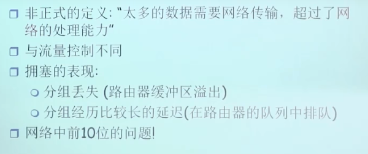
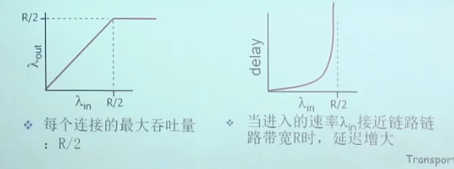
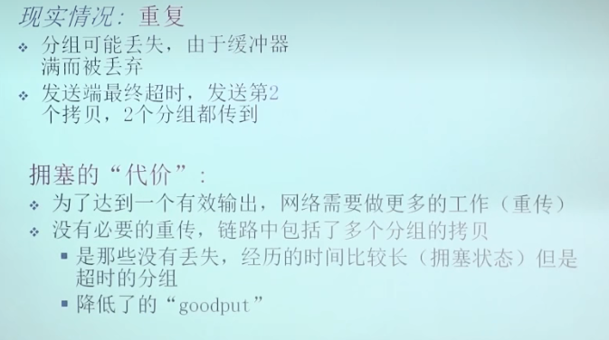
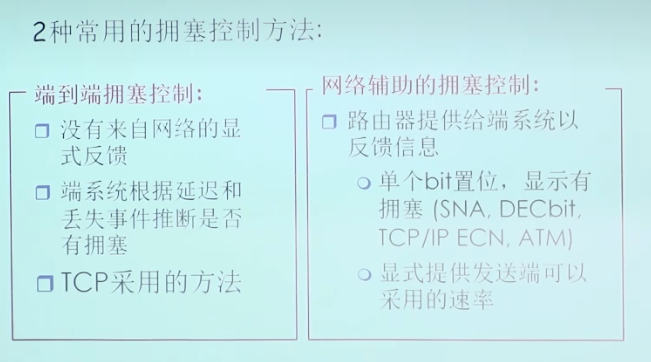

### 拥塞控制原理

* 拥塞
  * 
* 路由器的容量可能指的是路由器的带宽而不是路由器能容纳多少个bit
* 吞吐量和延迟关于输入速率的函数
* 
* 拥塞的代价：
  * 1.流量强度越大，延时就越大，趋近1时延时将会趋近无限大
  * 2.因为缓冲溢出的存在发送方需要重传被丢弃分组
  * 3.链路中的长时延将会导致发送方错误而多余的重传
* 拥塞控制方法：
  * 
* 异步传输网络的拥塞控制
  * ATM网络的传输SDU叫做信元，大小是53个字节
