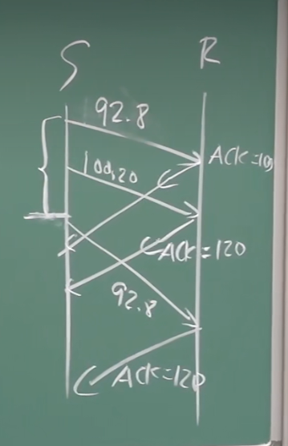

* TCP只提供点到点的服务
* TCP不提供区分报文的界限，应用进程的报文界限需要应用进程自己维护
* 应用进程通过层间接口向下交报文，然后传输层根据MSS的大小将报文段分成多个报文段，并在每个报文段加上TCP的头部
* 全双工的定义：在一个数据流上数据是可以双向流动的
* TCP概述：
* TCP报文段结构
  * 序号是双方在建立连接的时候就商量好的，然后这个序号就是第一个MSS的序号字段的值，从第二个MSS开始序号值都是第一个MSS序号加上报文段的长度，即表示每个报文段的第一个字节在整个报文段的一个偏移量；序号一般不是固定序号的，因为防止一些老的分组在网络中滞留，造成不必要的误会
  * 确认号：假如报文段的确认号是555，则说明555之前的都已经接收到了，希望下一个收到的是555
* 超时定时器的设置
  * 比RTT要长，但是RTT是变化的
  * 太短会过早超时造成不必要的重传
  * 太长会导致对报文段丢失的反应太慢，消极
* 估计RTT的方法
  * 
  * 越往前的贡献越小，移动平均要计算估计的RTT离sampleRTT的偏差的平均值
  * 就是先计算一个往返时间的估计值，在此基础上加上一个偏差范围的四倍，相当于计算了短时间内能覆盖99%以上情况的超时时间（类似3sigma原则）
* TCP是GBN和SR的一个混合体：只设置最老的段的超时计时器(GBN)，超时以后只重发最老的那个分组(SR)；当接收窗口接收到了一个乱序的报文段的时候，可以缓存也可以丢弃
* TCP重传的情况：
  * 超时
  * 收到三个冗余ACK——快速重传
* TCP发送方事件
  * 当base == nextseq的时候，超市定时器要关掉；当base向前移动的时候，发现还有没有确认的字节，需要重启超时计时器
  * base一次可以移动很多次
  * 接收方每次都是给顺序到来的最后一个字节的确认，比如ACK == 120，说明120之前的都已经收到了
* 接收方的事件，总共有4种情况
* 快速重传
* 流量控制：接收方通过捎带技术将自己空闲缓冲区的容量发送给发送方
* 连接管理：
  * 本质：双方都知道要和对方进行通信，控制变量要置位，准备好资源，告诉对方序号
  * 两次握手不行的原因：服务端会维持很多半连接，浪费资源；服务器会把旧的资源当作新的数据来收
  * 需要三次握手的原因：双方都需要告诉对方自己的初始序号是什么，最少需要三次，其中一方回复的时候可以捎带完成
* 连接释放：每个方向单独拆除，这样的释放是不完美的，因为最后一个半连接的拆除可能是不可靠的
