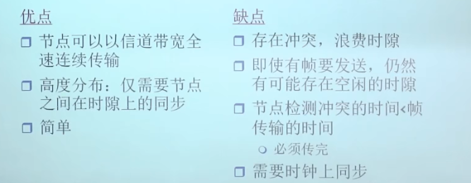
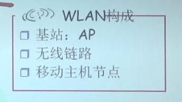

### 多路访问协议

* 一个分布式的算法决定共享式的channel来给谁使用，使用这个算法的协议就叫做map的协议
* 一个优秀的多路访问协议
  * 当一个节点要发送的时候，能够以R速率发送
  * 当M个节点要发送的时候，每个都可以以R/M的速率发送
  * 完全分布
    * 没有特殊节点协调别的节点发送信息
    * 没有时钟和时隙的同步
  * 简单
* 从协议的角度看，叫做MAP，从算法的角度看，叫MAC
* 分类
  * 信道划分
    * TDMA：划分时间片
      * 不同人不同时刻说话
    * FDMA：信道被划分成多个频段，每个站点拥有一个固定的频段
      * 不同组的人在不同的房间里通信
    * CDMA：码分，所有站点在整个频段上同时进行传输，采用编码原理进行区分
      * 不同的人使用不同的语言进行交流
  * 随机访问(random access)：允许碰撞
    * 当有数据要发送的时候，按照设计的速率全速发送，没有节点直接的协调
    * 具体分类
      * 时隙ALOHA：所有节点在时间上保持同步
        * 在本时隙形成帧的时候，只有等到下一个时隙才能开始发送
        * 没有时间上限，即不能保证过了几个时隙之后能让分组发送出去
        * 优缺点分析
      * 纯ALOHA
        * 简单、不需要在时间上进行同步
      * CSMA(carrier sense)：发言之前先侦听信道有没有人正在发信息，有的话就不发
        * 局域网中两个节点的距离越长，发生冲突的可能性就越大，因为无法即使监听其他节点是否正在发送，存在传播延时
      * CSMA/CD：对CSMA的改进
        * 检测到冲突以后，马上停止发送
        * 指数退避算法
      * CSMA/CA 无线局域网
        * WLAN构成，AP是access point
        * 不进行冲突检测，因为自己的电磁波信号远大于接收的电磁波信号
        * 由于有隐藏站点的存在，所以不冲突也不意味着成功
        * 由于暴露终端和信号衰减的原因，冲突也可能成功
        * 因为无法CD，所以这种方式需要进行确认
        * 监听到信道忙的时候，从一个窗口中选择一个随机值，当监听到信道空闲的时候该值减一，直到0的时候才发送
        * 由于无线局域网一旦发送就必须发完，所以如果再发生冲突的话代价高昂，所以只能采用事先避免冲突的方式
      * 
  * 依次轮流：take turn
    * 优点，高低负载效率都很高
    * 分类
      * 轮流MAC协议：存在单点故障问题
      * 令牌传递
