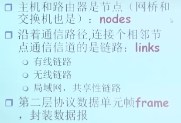

* 网卡实现了链路层和物理层的功能
* 链路层解决的问题
  * 
* 计算机的广域网一般来说采用点到点链路的方式连接
* 局域网则需要使用共享介质，即MAC问题
* 数据链路层能够解决的问题：负责从一个节点通过链路将帧中的数据报发送到物理相邻节点
* 术语规范
  * 
* 链路层提供的服务
  * 成帧
  * 在相邻两个节点之间完成可靠数据传输
    * 不是所有的链路层都实现可靠数据传输，当链路比较可靠的时候， 就不需要可靠数据传输了
  * 流量控制
  * 错误检测
  * 差错纠正
  * 半双工和全双工
