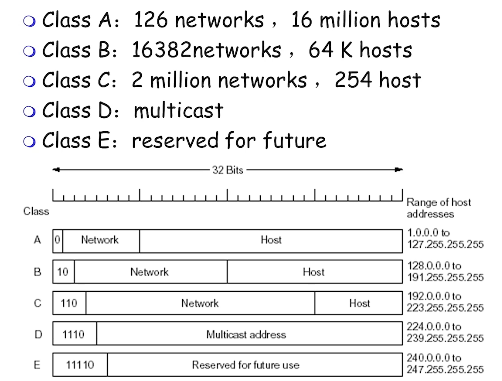
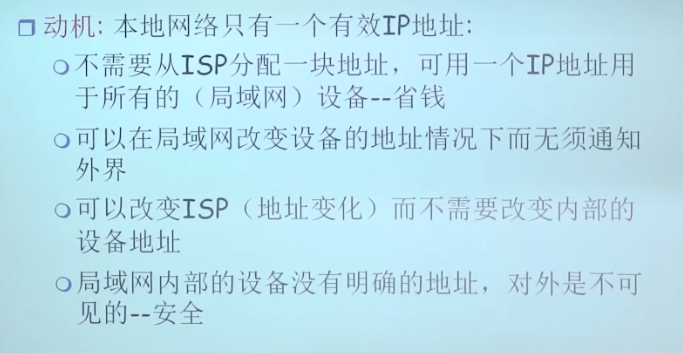

### IP协议

* ICMP协议是信令协议，用于报告错误的
* 主机只有一个IP地址，但是路由器一定有两个或以上的IP地址
* 子网内部在IP层面，一跳可达；子网内部的IP地址高位部分相同
* 区分子网的两个条件
  * IP前缀一样
  * 子网内部是否一条可达
* 在全球互联网范围内，是根据网络为单位进行传送的，每个网络一个表项而不是一个IP一个表项
* IP地址分类
* D类地址详见：[多播地址](http://www.95408.com/baike/353712.html)
* 内网地址不对外转发，在互联网范围内没有意义，每类IP地址都有专属的内网地址范围
* 无类域间路由，配套子网掩码来区分网络部分和主机部分
  * 把地址和子网掩码做与操作可以得到网络部分
* 设备如何获得IP地址
  * 系统管理员把覅之配置在文件中
  * DHCP
    * 需要获得的信息
      * IP
      * 子网掩码
      * local name server
      * 默认网关
    * 每次获得IP地址都有租用期，租用期完了需要renew；机器重启，不知道自己的IP地址是什么
    * 好处，大家不一定都同时上网，所以申请部分IP可以为更多用户进行服务，谁要用就给谁
    * 具体方式，第一次广播，第二次单播
* 路由通告，告诉其他路由器属于这个子网前缀的都发送给我；路由通告之后，进行路由聚集，路由聚集之后再次进行路由通告，但是这一次的通告网络号+子网号部分要更少
* NAT网络地址转换：内网的主机出去公用一个IP出去没问题，可以用映射进行保存，但是外面主动访问里面的话就有问题，因为端口号无法配对，这个问题被称作内网穿透问题，解决方式有
  * 固定写死地址转换
  * 动态增加mapping表项
  * 代理
* IPV6
