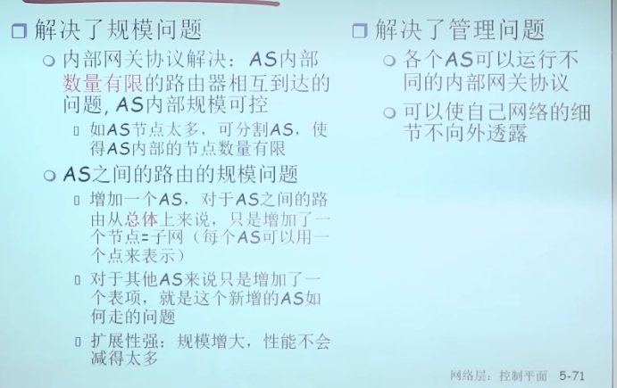
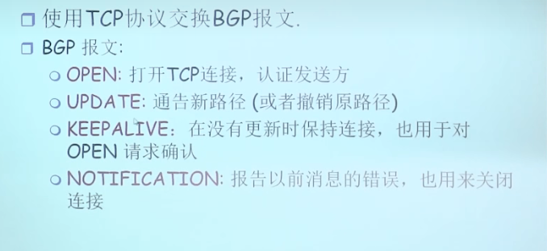
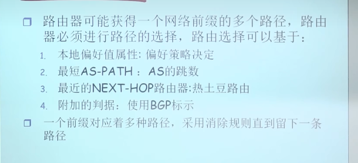

### 自治区之间的路由

* 所有网络当中的路由器的地位一样
* 在一个规模巨大的范围内使用直接DV和LS算法都是不可能的，所以解决办法是把按物理区域将互联网划分成一个个自治区，将问题分成了两个层面的，一个层面是自治区之间可达，一个是自治区内部如何进行协调和算法的选择
* 每个自治区有一个AS number，一个ISP可能包含一个as可能包含多个AS
* 层次路由的优点

### 网间路由协议

* eBGP
  * 网关路由器內部子网信息然后发送给其他的网关路由器的协议
* iBGP
  * 将网关路由器收集的其他子网的信息发送给自己子网内部的路由器
* bgp是基于距离矢量算法的，而且是一种改进的距离矢量算法，会告诉到达目标的过程中会穿过哪些自治区，从而可以检查出环路，能够更快的收敛
* 网关路由器同时运行eBGP和iBGP协议
* 自治区之间的路由更强调策略
* BGP的报文
* BGP路径选择
