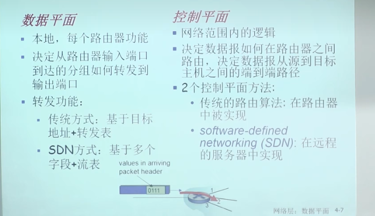
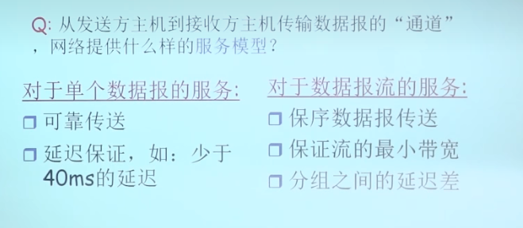

### 导论

* 转发和路由都有传统方式和SDN方式，所以二者的组合有四种
* 路由器的端口插什么网卡就接入到什么网络当中
* 转发是一个局部的概念，选择一个端口将分组打出去；是一个数据平面的功能
* 路由是一个全局的概念，决定了分组从发送主机到目标主机的路径；是一个控制平面的功能
* SDN方式中，流表不是由路由器算出来的，而是通过南向接口的网络操作系统算出来的
* 
* 传统方式下路由选择算法是分布式计算的；对于分组只有转发的功能；网络平面和数据平面是紧耦合的，紧耦合和分布式带来的问题是修改路由器的运行逻辑会有很大的困难
* SDN方式，远程控制器上运行的网络操作系统和每一个分组打交道，然后算出来流表再把流表给分组交换设备
* 网络服务模型的指标
  * 
* 对于网络层的连接而言是有连接的，因为中间的网络设备也要维护这个连接
