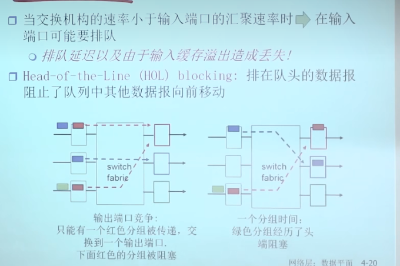

### 路由器的组成 

* 路由处理器运行了路由协议的实体，可能是一个软件，然后将运算出来的路由表到达各个输入端口
* 每个输入端口都需要在物理层，数据链路层和网络层之间封装和解封装、
* 输入端口缓存
  * 可能会出现头端阻塞
* 三种fabric的工作方式：目的是将分组从输入缓冲区传输到合适的输出端口
  * 基于memory
  * 基于bus
  * 基于crossbar
* fabric的交换速率通常要是输入端口个数的N倍，保证fabric本身不会称为瓶颈
* 调度策略是从缓存的分组选择打出去分组的策略
