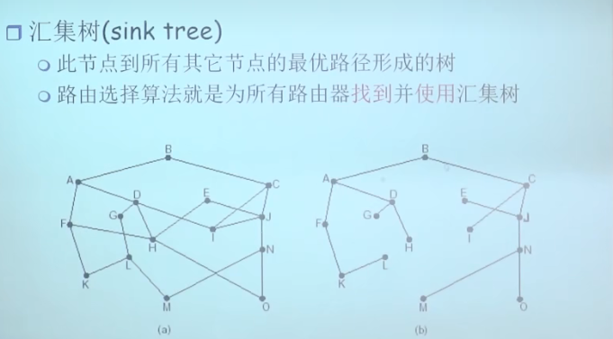
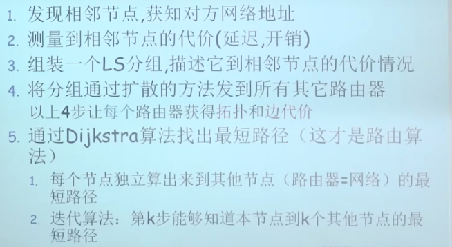
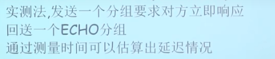
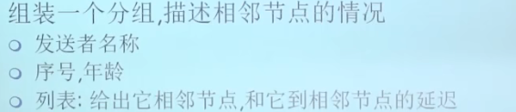
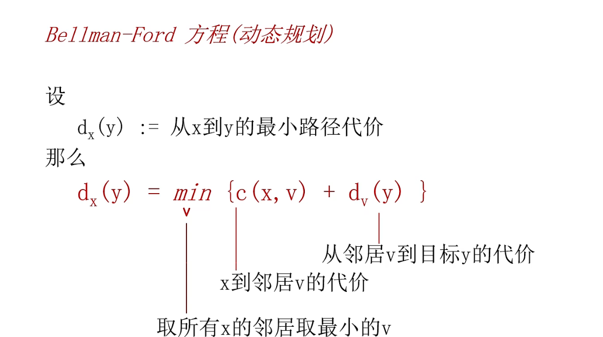

### 路由选择算法

* 目的是找到一条源子网到目标子网的一跳较好的路径，第一条和最后一条不用找，都是直接通过交换机就可以到达的
* 下一跳，到目标节点的下一条路径
* 算法的目的是算出source到所有目标主机的最优路径
* 汇集树取的一定是汇集树而不是环
* 路由选择算法的原则
  * 正确性
  * 简单性：不能为了算出最优路径增加很多的通信量
  * 健壮性：算法应该能够适应通信量和网络拓扑的变化
    * 不向拥挤的链路发送数据
    * 不向已经断了的链路发送数据
  * 稳定性：产生的路由不应该摇摆
  * 公平性：对每一个站点都要公平
  * 最优性：能够使得路径在某一个指标上最优，或者在综合指标上最优
  * 全局路由选择算法需要每一个节点都获得全局的路由拓扑结构
    * 每一个节点通过邻居节点获得到目标主机的代价，即分布式地获取全局路由信息，然后迭代地算出到目标节点的路径

## 1、link state(链路状态算法)，又Dijkstra算法

* 通过各种渠道(分组泛洪的方法)获得全网拓扑
* 具体步骤前四步都是为了获得全网拓扑，每个路由节点封装自己到邻居节点的代价信息，形成链路状态分组，然后把链路状态分组在全网进行泛洪
  * 第一步做法：向周围发送hello，然后邻居遵守相同的协议，hello back
  * 第二步做法
    * 
  * 第三步做法
  * 第四步：链路状态分组的泛洪是可靠的泛洪，是可控制的
* 使用该算法可能会造成链路震荡的效果，即算出该路径代价比较小，所以大家都走这条路径，从而导致这条路径拥塞，这是这条路径代价又变大了

## 2、DV算法(距离矢量路由选择)

* 该算法的基本思想：
  * 各个路由器维护一张路由表
  * 各个路由器和相邻路由器交换路由表
  * 根据获得的路由信息，更新路由表
* 该算法设计的动规方程通过若干次迭代最终一定能收敛到最优值
* 好消息传得快，坏消息传得慢
* 水平分裂(毒性逆转)算法可以解决坏消息传得慢的做法，但是对于有环的链路而言，如果环外某个节点真的不可达，仍然需要无限次的迭代才能最终获得不可达的真实情况
